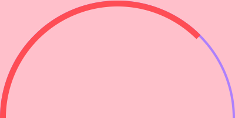
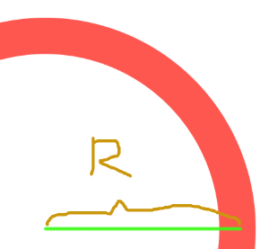
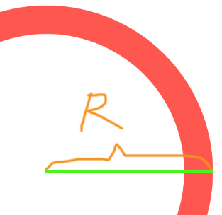
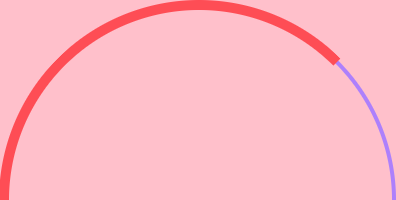
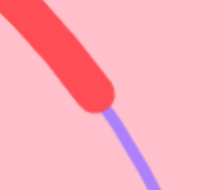
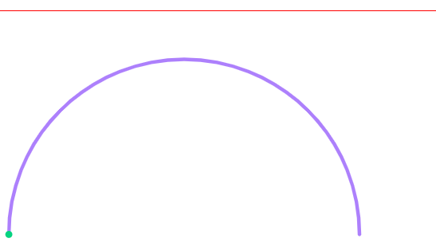

先上效果图：


这种图形大家应该都见过，俗称仪表盘，当然，上图只是个最基本的仪表盘架子，可能在实际场景中还会其他很多花里胡哨的点缀，那些暂且不管，不是关键，这东西经常见到，但还没亲自上手在代码层面实现过，最近做的一个需求恰好有这个场景，这里归纳一下

## Canvas 实现

大部分情况下，对于这种偏可视化的元素，一般都选择使用 `canvas`来进行绘制，现在已经 `9120`年了，线上使用 `canvas`完全没问题

仪表盘整体是一个复杂图形，而复杂图形是由简单图形组合而成，只要把所有组成这个仪表盘的简单图形绘制出来，再进行组合，整个仪表盘自然也就绘制出来了

所以，首先对仪表盘进行分解，分解成 `canvas`能绘制出的基本图形，其主体其实就两个圆弧，一个是底部蓝色的半圆轨道，一个是代表进度的红色圆弧，其实都是圆弧，`canvas`刚好有绘制圆弧的能力，即：
```js
ctx.arc
```

至于动态绘制，只需要配合 `requestAnimationFrame`即可

```js
const trackW = 6
const rx = 500
const ry = 500
const radius = 400
const innerLineW = 20
const canvas = document.getElementById('canvas')
const ctx = canvas.getContext('2d')
function draw (toAngle, currentAngle = Math.PI) {
  ctx.clearRect(0, 0, canvas.width, canvas.height)
  // 半圆轨道
  ctx.beginPath()
  ctx.strokeStyle = '#ad80fc'
  ctx.lineWidth = trackW
  ctx.arc(rx, ry, radius, Math.PI, 0, false)
  ctx.stroke()
  // 圆弧
  ctx.beginPath()
  ctx.lineCap = 'round'
  ctx.strokeStyle = '#fe4d55'
  ctx.lineWidth = innerLineW
  ctx.arc(rx, ry, radius, Math.PI, currentAngle, false)
  ctx.stroke()
  if (currentAngle < toAngle) {
    currentAngle += 0.02
    if (currentAngle > toAngle) currentAngle = toAngle
    requestAnimationFrame(() => {
      draw(toAngle, currentAngle)
    })
  }
}
draw(1.5 * Math.PI)
```

加上变量定义，花括号等几十行代码即可完成，由此可见，`canvas`绘图还是很方便的，所以在可视化领域，例如一些库或者`UI`组件基本上都是以`canvas`进行构建

## CSS 实现

`canvas`实质上就是借助 `js`操纵浏览器 `API`进行渲染，然而 `UI`渲染这种事情本应该交给 `CSS`来做才是，感觉用 `js`直接画多影响性能啊（实际上并不），哪有 `css`来的流畅，实际上，`css`完全可以做到

从 `css`的角度对仪表盘进行分解，同样还是两个圆弧，通过设置 `border-radius`属性即可让元素呈现整圆效果，然后再用一个矩形元素进行遮罩，决定展现出来的部分，即为圆弧，通过控制遮罩的面积来呈现动态绘制的效果

```html
<div class="arc-wrapper">
  <p class="track-arc"></p>
  <div class="round-box">
    <p class="round"></p>
  </div>
</div>
```

```css
:root {
  --arcRadius: 200px;
  --rectWidth: calc(var(--arcRadius) * 2);
  --trackWidth: 4px;
  --roundWidth: 10px;
}
.arc-wrapper {
  position: relative;
  margin: 0 auto;
  width: var(--rectWidth);
  height: var(--arcRadius);
  overflow: hidden;
  background-color: pink;
}
.track-arc {
  width: 100%;
  height: var(--rectWidth);
  box-sizing: border-box;
  border-radius: 50%;
  border: var(--trackWidth) solid #ad80fc;
}
.round-box {
  position: absolute;
  left: 0;
  top: 0;
  width: 100%;
  height: 100%;
  overflow: hidden;
  transform-origin: 50% 100%;
  transform: rotate(-45deg);
  z-index: 20;
}
.round {
  width: 100%;
  height: var(--rectWidth);
  box-sizing: border-box;
  border-radius: 50%;
  border: var(--roundWidth) solid #fe4d55;
}
```

其实没多少代码，也没什么难以理解的，只不过效果似乎微调：



由于圆弧的线是存在宽度的，并不是数学意义上的可以忽略，`canvas`绘制圆弧，是根据圆心坐标和半径进行绘制的，绘制出来的圆弧会自动根据圆弧 `line`的宽度进行调整，即圆弧的半径是圆弧线的中心位置与圆心坐标距离



而通过 `css`绘制的圆弧，此圆弧的半径则是圆弧最外层边线与圆心的坐标距离:



知道了问题其实就好解决了，只要缩减轨道半圆的半径，并对其进行一定的偏移即可：

```css
.track-arc {
  --trackArcSize: calc(var(--rectWidth) - var(--roundWidth) + var(--trackWidth));
  /* 尺寸改变 */
  width: var(--trackArcSize);
  height: var(--trackArcSize);
  box-sizing: border-box;
  border-radius: 50%;
  border: var(--trackWidth) solid #ad80fc;
  /* 位置偏移 */
  transform: translate(calc(var(--roundWidth) / 2 - var(--trackWidth) / 2), calc(var(--roundWidth) / 2 - var(--trackWidth) / 2));
}
```

然后就顺眼多了：


然而，还有个问题，一般为了呈现更加圆润的效果，设计稿上圆弧的断点处一般都是圆头：


而上述呈现出来的效果是直接截断的：


一般人之所以不使用 `css`来绘制仪表盘，基本都是因为这个原因，`canvas`简简单单通过设置一个 `ctx.lineCap = 'round'`就能解决的问题。似乎 `css`无解了

乍一看好像确实没什么好办法，但稍微思考下，这不就是一个圆角吗，完全在`css`能力范围内啊，只不过实现的方式不太那么直接罢了

方法很简单，就是使用一个圆角矩形覆盖在圆弧的顶端，将圆弧本身的矩形顶端覆盖住，圆角矩形当做是圆弧的顶端，这样视觉上看起来不就是圆头了吗

```html
<div class="round-box">
  <p class="round"></p>
  <p class="dot-r-box">
    <span class="dot-r"></span>
  </p>
</div>
```

```css
.dot-r-box {
  position: absolute;
  right: 0;
  bottom: 0;
  width: var(--roundWidth);
  height: var(--dotHeight);
  background-color: var(--backColor);
}
.dot-r {
  display: inline-block;
  width: 100%;
  height: 100%;
  /* 这里的100px只是为了呈现出最大限度的圆角 */
  border-bottom-left-radius: 100px;
  border-bottom-right-radius: 100px;
  background-color: var(--roundColor);
}
```
效果如下：


圆角顶端 get

同样的，圆弧左边的顶端也可以这么做


不过左边这个顶端有个稍微需要注意的地方，因为其存在的目的是为了当做圆弧的左断点，但是当进度为 `0`的时候，圆弧应该是完全不展现的，或者当进度很小的时候，圆弧应该展现的长度还没有 `dot-l`的高度大，这样就露馅了：


不过呢转而又一想，一般实际场景中，就算进度为 `0`，我们其实为了看起来更符合常识直觉，也会让圆弧展现一点点出来，只要 `dot-l`的高度不是太大，或者说只要圆弧的宽度不要太宽，其实预留的这点圆弧完全就可以 `cover`住了，不至于露馅

## SVG 实现

`SVG`意为可缩放矢量图形，既然是图形当然就能实现图形，由于其专业性，相比于上述两种方法来说，`SVG`的实现更加简单

首先，定义一段 `SVG`片段：
```html
<svg xmlns="http://www.w3.org/2000/svg" version="1.1" style="border: 1px solid red; width: 500px; height: 300px;">
  <path fill="none" stroke-linecap="round" class="outerArc" />
  <path fill="none" stroke-linecap="round" class="innerArc" />
</svg>
```
两个 `path`元素，第一个 `outerArc`用于绘制半圆轨道，第二个用于绘制真正的进度条，通过设置这两个 `path`的 `d`属性，即可实现效果，实现的方法有很多，本文选取的方法是通过控制  `path`的 `stroke-dasharray` 和 `stroke-dashoffset`进行实现，不熟悉这两个属性的可以参考文章：

- [张鑫旭 纯CSS实现帅气的SVG路径描边动画效果](https://www.zhangxinxu.com/wordpress/2014/04/animateion-line-drawing-svg-path-%E5%8A%A8%E7%94%BB-%E8%B7%AF%E5%BE%84/)
- [初窥 SVG Path 动画](https://www.imweb.io/topic/577932e9f525c4613e8b4012)

效果如下：



## 小结

`css`的新特性 `var` 和 `calc`还挺好用的嘛

本文完整示例 [Live Demo]() 和 [示例代码]() 已经上传，感兴趣的可以亲自试下