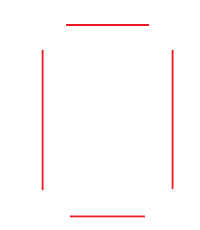
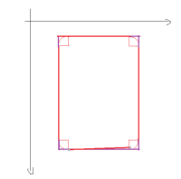
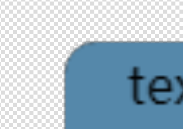

微信小程序允许对普通元素通过 `border-radius`的设置来进行圆角的绘制，但有时候在使用 `canvas`绘图的时候，也需要圆角，例如需要将页面上某块区域导出为图片下载到本地的时候，常用的解决方法就是使用 `canvas`将这块区域绘制出来，最后导出 `canvas`即可，但是 `canvas`没有直接提供圆角的绘制 `api`，所以需要 `曲线救国`

---

圆角矩形与一般矩形的区别在于，前者的四个角都是圆弧，所以只需要将一般矩形的四个角切掉，换成圆弧即可，如下图就是一个一般矩形被切掉了四个角的样子：



很明显，切掉了四个角的矩形，剩下其实就是四条 `line`，既然如此，完全可以跳过绘制矩形然后切角这一步，因为切角的结果就是四条边(`line`)，直接绘制四条边即可。
然后在每两条边的缺角处绘制弧度为 `0.5 * Math.PI` 的圆弧，最后这四条边与四个圆弧所封闭的图形就是圆角矩形：



原理知道了，代码就很好写了，这里只说几个注意点：

- 封闭图形的 `fillStyle`颜色设置为 `transparent`

想将封闭路径的图形绘制下来，需要调用 `stroke`或 `fill`方法，默认 `stroke` 或 `fill`的颜色是 `black`，但是这里有个问题，
圆弧的绘制可能会出现锯齿或者糊边，如果 `stroke` 或 `fill`的颜色，与你所需要绘制的圆角矩形的边缘色调不一致，这种糊边的感觉会比二者色调一致的更明显，
下图左为色调一致，右为色调不一致的情况：

 

不过据我观测，只要不是特意放大仔细看，无论是色调是否一致，其实一般人很难注意到糊边的事情

- `clip`

绘制好了圆角选区之后，还需要调用 `ctx.clip`方法来裁剪选区

- `save` 与 `restore`

如果这个矩形选区只是 `canvas`画布的一部分，为了避免对后续的影响，最好在 `beginPath`之前，将之前的动作 `save`，然后画完后再 `restore`

一个关于 **在 `canvas`上绘制圆角图片，并下载到本地** 的可运行示例代码已经放到 [github](https://github.com/accforgit/blog-data/tree/master/%E5%B0%8F%E7%A8%8B%E5%BA%8Fcanvas%E7%BB%98%E5%88%B6%E5%9C%86%E8%A7%92%E7%9F%A9%E5%BD%A2/project)上了，注释也比较详细，需要的可自取

其中关键代码如下：

```js
/**
  * 
  * @param {CanvasContext} ctx canvas上下文
  * @param {number} x 圆角矩形选区的左上角 x坐标
  * @param {number} y 圆角矩形选区的左上角 y坐标
  * @param {number} w 圆角矩形选区的宽度
  * @param {number} h 圆角矩形选区的高度
  * @param {number} r 圆角的半径
  */
function roundRect(ctx, x, y, w, h, r) {
  // 开始绘制
  ctx.beginPath()
  // 因为边缘描边存在锯齿，最好指定使用 transparent 填充
  // 这里是使用 fill 还是 stroke都可以，二选一即可
  ctx.setFillStyle('transparent')
  // ctx.setStrokeStyle('transparent')
  // 左上角
  ctx.arc(x + r, y + r, r, Math.PI, Math.PI * 1.5)

  // border-top
  ctx.moveTo(x + r, y)
  ctx.lineTo(x + w - r, y)
  ctx.lineTo(x + w, y + r)
  // 右上角
  ctx.arc(x + w - r, y + r, r, Math.PI * 1.5, Math.PI * 2)

  // border-right
  ctx.lineTo(x + w, y + h - r)
  ctx.lineTo(x + w - r, y + h)
  // 右下角
  ctx.arc(x + w - r, y + h - r, r, 0, Math.PI * 0.5)

  // border-bottom
  ctx.lineTo(x + r, y + h)
  ctx.lineTo(x, y + h - r)
  // 左下角
  ctx.arc(x + r, y + h - r, r, Math.PI * 0.5, Math.PI)

  // border-left
  ctx.lineTo(x, y + r)
  ctx.lineTo(x + r, y)

  // 这里是使用 fill 还是 stroke都可以，二选一即可，但是需要与上面对应
  ctx.fill()
  // ctx.stroke()
  ctx.closePath()
  // 剪切
  ctx.clip()
}
```

